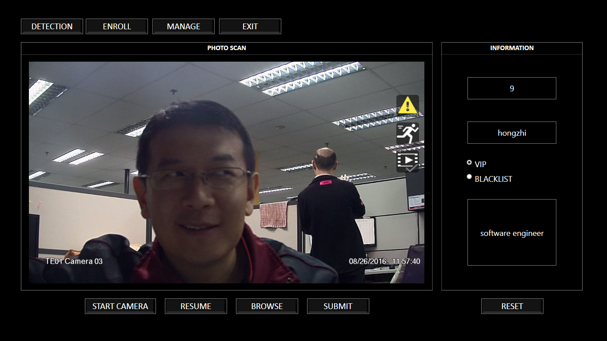
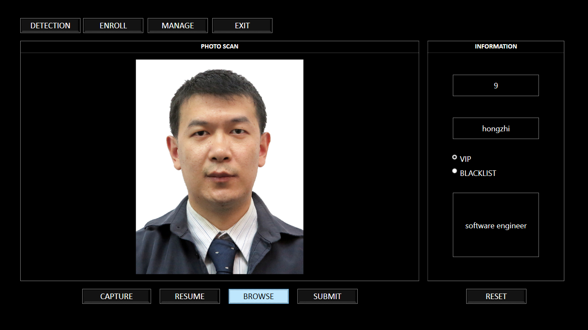
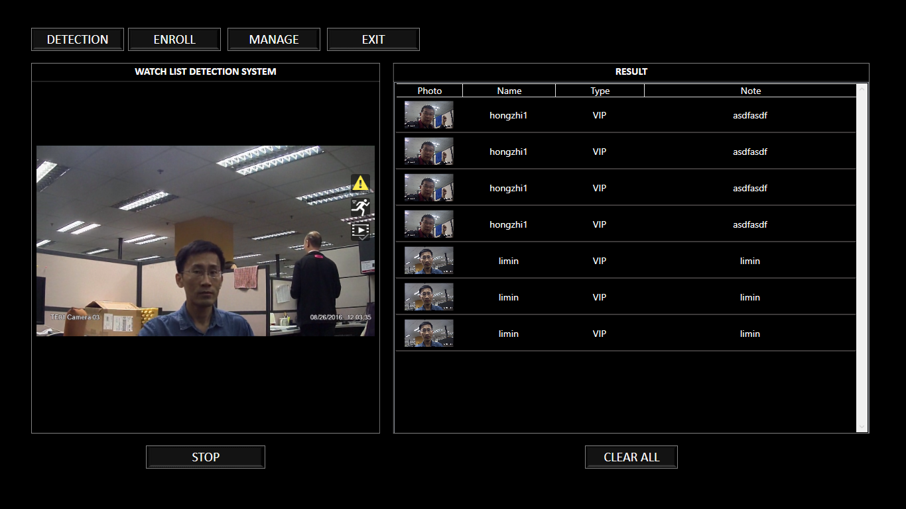

# VideoAnalysis
A video analysis software is a user program that is installed on surveillance cameras to review video footage that has already been captured. It evaluates the visual coverage into fine details that are crucial to the user. The technician in charge of a place like a business premise sets specific parameters that the Video Analytics Software will analyze. For instance, in a supermarket, you may set detection of strange movements of customers that would suggest shoplifting and unusual engagement with a cashier. The analytics software can be used for facial recognition, motion detection, queue monitoring, reading license plate, and unlimited personalized suggestions.

# Folder Structure
+ Config: include DB script, initial config file, log config file
+ Core: Common files and DAI files
+ VideoManager: Main GUI, include camera assign, **Facial recognition**
+ ObjectDetect: ObjectDetect Application

This Application use WPF as framework.

# Function Description
1. Camera assignment:  
Drag and Drop one camera from left camera list to quad screen, then you will see the video from this camera show in correspoind quad screen.

2. Facial Recognition:  
This function capable of matching a human face from a digital image or a video frame against a database of faces, typically employed to authenticate users through ID verification services, works by pinpointing and measuring facial features from a given image.  
Facial recognition systems attempt to identify a human face, which is three-dimensional and changes in appearance with lighting and facial expression, based on its two-dimensional image. To accomplish this computational task, facial recognition systems perform four steps. First face detection is used to segment the face from the image background. In the second step the segmented face image is aligned to account for face pose, image size and photographic properties, such as illumination and grayscale. The purpose of the alignment process is to enable the accurate localization of facial features in the third step, the facial feature extraction. Features such as eyes, nose and mouth are pinpointed and measured in the image to represent the face. The so established feature vector of the face is then, in the fourth step, matched against a database of faces.
+ Enroll: Take a photo of candidate, his information will be added to database   

+ Enroll existing photo: Upload a photo of candidate, his information will be also be added to database  

+ Detection: Candidate Walk by the camera, this application will detect your appearance by keep parsing video stream   
  
In this scenario, there are 2 parameters config in start.ini:  
    - ProbeInterval=2000  
    It is frequency to parse the camera video stream, This application will create image from video stream, then use algorithm to measure the facial features.
    - Score=0.67  
    Each parse will get a score from 0 to 1, if above this threshold, will be treated as detected
+ Enroll Management  
Operator can delete existing enrolled candidate from database here.   
  

3. Object Detection
This application will keep detect the object by some rule, if detected, one alarm will be triggered and show in the alarm list.

# License
This Application is under the GPL license. See the [LICENSE](LICENSE) file for details..